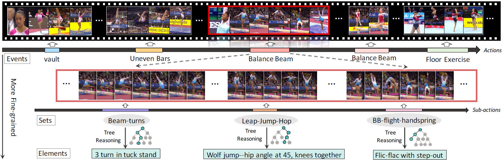

# FineGym: A Hierarchical Video Dataset for Fine-grained Action Understanding

### [Project Page](https://sdolivia.github.io/FineGym/) | [Videos](https://www.youtube.com/playlist?list=PL2wRKCL5yrJRBnIxWhmVr3xLJahdK5DGJ) | [Paper](https://arxiv.org/abs/2004.06704)

[FineGym: A Hierarchical Video Dataset for Fine-grained Action Understanding](https://sdolivia.github.io/FineGym/)  
 [Dian Shao](https://sdolivia.github.io/)1,
 [Yue Zhao](https://zhaoyue-zephyrus.github.io)1,
 [Bo Dai](http://daibo.info/)1,
 [Dahua Lin](http://dahualin.org/)1  
 1 MMLab, The Chinese University of Hong Kong

    

## News!
- 07/2020: We release **pre-extracted features of FineGym dataset from 20 models** for you to choose freely! See the following for more details!
- 05/2020: Talks and Demo about FineGym can all be found here: [FineGym Youtube Playlist](https://www.youtube.com/playlist?list=PL2wRKCL5yrJRBnIxWhmVr3xLJahdK5DGJ).
- 04/2020: Annotations of FineGym Dataset are released! Please refer to [FineGym Homepage](https://sdolivia.github.io/FineGym/) for more details!
- 03/2020: The Paper [FineGym: A Hierarchical Video Dataset for Fine-grained Action Understanding](https://openaccess.thecvf.com/content_CVPR_2020/html/Shao_FineGym_A_Hierarchical_Video_Dataset_for_Fine-Grained_Action_Understanding_CVPR_2020_paper.html) is accepted by CVPR 2020 as an Oral Paper, and we got Three Strong Accepts!

## Model Zoo
### Element-level Action Recognition
For Gym99 (for details of the subset gym99 & gym288 please refer to the [FineGym Homepage](https://sdolivia.github.io/FineGym/)) :

| Model        | Backbone     | Pre-trained | Fine-tuned | Mean Class ACC | Top-1 ACC | Train-features            | Val-Features            | Feature-size per inst. |
|--------------|--------------|-------------|------------|----------------|-----------|---------------------------|-------------------------|------------------------|
| BN-Inception | BN-Inception | ImageNet    | -          | -              | -         | [Gym99-train-bninception](https://mycuhk-my.sharepoint.com/:u:/g/personal/1155102589_link_cuhk_edu_hk/EWp_bwo_3BhKnDl_9fuT9loBCKr1ZwthAd3G5JCNZeQR-Q?e=SgD84k) | [Gym99-val-bninception](https://mycuhk-my.sharepoint.com/:u:/g/personal/1155102589_link_cuhk_edu_hk/EZ6UTdAC3mtOgzBF4unet-IB0kt1I7o7J9cLFI_M59a0ow?e=2fcTUP) | 12 x 1024 x 1 x 1      |
| ResNet50     | ResNet50     | ImageNet    | -          | -              | -         | [Gym99-train-r50](https://mycuhk-my.sharepoint.com/:u:/g/personal/1155102589_link_cuhk_edu_hk/EeuCIumq7w9Nh638l5HClfQB-3uKfOrRhEAScXdOOSISmg?e=Eey0ki)        | [Gym99-val-r50](https://mycuhk-my.sharepoint.com/:u:/g/personal/1155102589_link_cuhk_edu_hk/EWDF16t7QP5Ep53XRNwoyYEBHsxxwWp31u0MZe2idwafuA?e=DYY461)        | 12 x 2048 x 1 x 1      |
| TSN          | BN-Inception | ImageNet    | Gym99      | 61.4           | 74.8      | [Gym99-train-tsn](https://mycuhk-my.sharepoint.com/:u:/g/personal/1155102589_link_cuhk_edu_hk/EWC-2Ybmg29Ph-PvXVTGkQ4BtXhgmyDbFjVtvWqC1Hkixg?e=WZpkgs)        | [Gym99-val-tsn](https://mycuhk-my.sharepoint.com/:u:/g/personal/1155102589_link_cuhk_edu_hk/ESOtRR4l25BDo73sEDmASFkBvT91mpmLJJ5QiVjvsFGvMg?e=RbvlLX)        | 12 x 1024 x 1 x 1      |
| I3D          | ResNet50     | ImageNet    | Gym99      | 63.2           | 74.8      | [Gym99-train-i3d-imnet](https://mycuhk-my.sharepoint.com/:u:/g/personal/1155102589_link_cuhk_edu_hk/ETVeYq1dcEFHgfnAe1ddkRcBi8yvyIygkoZavRXo603Tjg?e=KuzHgK)  | [Gym99-val-i3d-imnet](https://mycuhk-my.sharepoint.com/:u:/g/personal/1155102589_link_cuhk_edu_hk/EdzG5N-hY9JJrnPH2vh6y9oB6cRk9yAzzH_qiyOtYsYlZw?e=VOkFGt)   | 12 x 2048 x 1 x 1 x 1  |
| I3D          | ResNet50     | Kinetics    | Gym99      | 64.4           | 75.6      | [Gym99-train-i3d-kin](https://mycuhk-my.sharepoint.com/:u:/g/personal/1155102589_link_cuhk_edu_hk/EeudyBaE3TFHgA51N5K_p0oBfRLIztvQozwTgyuScTLCZg?e=uj01bP)    | [Gym99-val-i3d-kin](https://mycuhk-my.sharepoint.com/:u:/g/personal/1155102589_link_cuhk_edu_hk/Ea7D_mqwCQhPicwY683uEVQBX87RcK3NFvGn7VycxsgIJw?e=GSv8Hp)    | 12 x 2048 x 1 x 1 x 1  |

For Gym288:

| Model        | Backbone     | Pre-trained | Fine-tuned | Mean Class ACC | Top-1 ACC | Train-features            | Val-Features            | Feature-size per inst. |
|--------------|--------------|-------------|------------|----------------|-----------|---------------------------|-------------------------|------------------------|
| BN-Inception | BN-Inception | ImageNet    | -          | -              | -         | [Gym288-train-bninception](https://mycuhk-my.sharepoint.com/:u:/g/personal/1155102589_link_cuhk_edu_hk/EYqAEHlOl6hEid63SbjmJvMBQ5h129g6IQpbTQn6aGpzgw?e=lR1xqU) | [Gym288-val-bninception](https://mycuhk-my.sharepoint.com/:u:/g/personal/1155102589_link_cuhk_edu_hk/EdNj7JEM0ExOtsRkDbVN1p0BX8lKCbeVrtWl6BDM5wk9vQ?e=Mhw4eA) | 12 x 1024 x 1 x 1      |
| ResNet50     | ResNet50     | ImageNet    | -          | -              | -         | [Gym288-train-r50](https://mycuhk-my.sharepoint.com/:u:/g/personal/1155102589_link_cuhk_edu_hk/ETiDkaMwv7pDpUwAhFC2QPQBjDHV0RELIM1Fh7T_lm_MwA?e=jW5QVh)        | [Gym288-val-r50](https://mycuhk-my.sharepoint.com/:u:/g/personal/1155102589_link_cuhk_edu_hk/EbPBj_CK4LNJhZz6HX9PRYUBeLsz1ZfZ3yz3ZWgoKdNWUg?e=xWJvpS)        | 12 x 2048 x 1 x 1      |
| TSN          | BN-Inception | ImageNet    | Gym288      | 26.5           | 68.3      | [Gym288-train-tsn](https://mycuhk-my.sharepoint.com/:u:/g/personal/1155102589_link_cuhk_edu_hk/EVlPt1lrESRHhxEZB66uxkkB4ix1f3bxCMC1VOdUgqsqGw?e=d8BLWn)        | [Gym288-val-tsn](https://mycuhk-my.sharepoint.com/:u:/g/personal/1155102589_link_cuhk_edu_hk/ERbIErgfPx9Jnc7_wvmZvlcBTMAOkmuHs36r2uhuM-JH4Q?e=sk0BVF)        | 12 x 1024 x 1 x 1      |
| I3D          | ResNet50     | ImageNet    | Gym288      | 27.9           | 66.7      | [Gym288-train-i3d-imnet](https://mycuhk-my.sharepoint.com/:u:/g/personal/1155102589_link_cuhk_edu_hk/Eb7FUhaSadJMhIoaVn1HuLABQnGBvh-t_Imim4sVUjowZQ?e=2yewbU)   | [Gym288-val-i3d-imnet](https://mycuhk-my.sharepoint.com/:u:/g/personal/1155102589_link_cuhk_edu_hk/EaVIur0D-mRHly8UNzRLeiQBxKjPLKHOzmvrcFbNhr4QpA?e=Ew02pt)   | 12 x 2048 x 1 x 1 x 1  |
| I3D          | ResNet50     | Kinetics    | Gym288      | 28.2           | 66.1      | [Gym288-train-i3d-kin](https://mycuhk-my.sharepoint.com/:u:/g/personal/1155102589_link_cuhk_edu_hk/Eax2oWt9tmdKiWxPNiDBhrUBaOxtqN-tzLm2cMkzNHYEfg?e=bqwhJL)    | [Gym288-val-i3d-kin](https://mycuhk-my.sharepoint.com/:u:/g/personal/1155102589_link_cuhk_edu_hk/EX2cHh7F0stHp34ybUC-5WEBmAeIjrQwjVURP6YzDH5pcg?e=geBzO7)    | 12 x 2048 x 1 x 1 x 1  |

#### Notes
- All feature files are in 'pickle' format, whose types are Python Dictionaries. 
- The keys of each Feature Dictionary are element id in:
	- [Gym99 Train split](https://sdolivia.github.io/FineGym/resources/dataset/gym99_train_element_v1.0.txt) or 
	- [Gymm99 Val split](https://sdolivia.github.io/FineGym/resources/dataset/gym99_val_element.txt) or 
	- [Gym288 Train split](https://sdolivia.github.io/FineGym/resources/dataset/gym288_train_element_v1.0.txt) or 
	- [Gym288 Val split](https://sdolivia.github.io/FineGym/resources/dataset/gym288_val_element.txt). 
- E.g. key: A0xAXXysHUo_E_002184_002237_A_0035_0036; The corresponding values are extracted features for that action instance. 
- The number of element-level action instances:
	- for Gym99 (v1.0) are 20484/8521 for Train/Val set respectively;
	- for Gym288 (v1.0) are 22671/9646 for Train/val set respectively.
- To keep the size of each feature file relatively small (mostly 1~2 G per file), the spatial information is pooled, resulting in spatial shape: 1 x 1.
- Details of model training and results please refer to our paper and supplementary material.
- Note that for I3D models, the extracted features are dense (i.e. seg=12, 8 frames per seg), since many element-level instances last only for 1~2 seconds.
